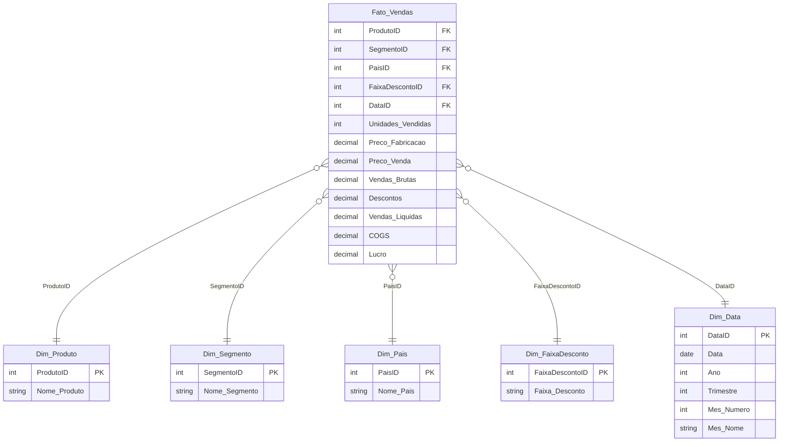

# ⭐ Criando um Star Schema para Cenários de Vendas com Power BI

Projeto desenvolvido para o **Desafio de Projeto — Formação Power BI Analyst (DIO)**.

O objetivo é pegar um modelo de dados **relacional/flat** (uma única tabela de vendas, com todas as colunas misturadas) e remodelá-lo em um **esquema dimensional (Star Schema)**, com uma tabela fato central e tabelas dimensão ao redor, prontas para consumo eficiente no Power BI.

> Base de dados utilizada: **Financial Sample** (dataset de amostra padrão do Power BI), com colunas de Segmento, País, Produto, Faixa de Desconto, Unidades Vendidas, Preços, Vendas, Descontos, COGS, Lucro e Data.

---

## 🧩 Do modelo relacional (flat table) para o Star Schema

### Modelo original (tabela única/relacional)

Todas as informações estavam em uma única tabela larga, misturando fatos (números que se medem) com atributos descritivos (texto que categoriza):

| Segment | Country | Product | Discount Band | Units Sold | Manufacturing Price | Sale Price | Gross Sales | Discounts | Sales | COGS | Profit | Date |
|---|---|---|---|---|---|---|---|---|---|---|---|---|

Isso gera repetição de dados (o mesmo país, produto ou segmento aparece em milhares de linhas), dificulta a manutenção e deixa o modelo mais pesado para o motor do Power BI (VertiPaq).

### Modelo dimensional (Star Schema)



### Por que separar assim?

- **Fato_Vendas** guarda só o que é *mensurável* (quantidades e valores) + as chaves para as dimensões.
- Cada **dimensão** guarda um atributo descritivo, sem repetição, com uma chave primária única.
- O relacionamento é sempre **1 (dimensão) para N (fato)**, com o filtro fluindo da dimensão para a fato.
- Resultado: modelo mais leve, consultas DAX mais rápidas, e uma estrutura muito mais fácil de entender e dar manutenção — o clássico "formato de estrela", com a fato no centro e as dimensões ao redor.

---

## 🛠️ Como o modelo foi construído no Power BI

1. **Power Query (Transformar Dados)**: a partir da tabela original, criei consultas de referência para gerar cada dimensão (`Dim_Produto`, `Dim_Segmento`, `Dim_Pais`, `Dim_FaixaDesconto`, `Dim_Data`), usando "Remover Duplicatas" nas colunas de interesse e adicionando uma coluna de índice como chave primária.
2. **Tabela Fato**: mantive a consulta original, fiz o *merge* com cada dimensão para trazer a chave (ID), e depois removi as colunas de texto que já estavam representadas nas dimensões — sobrando só as chaves + as métricas numéricas.
3. **Modelagem (aba Modelo)**: arrastei as tabelas para montar visualmente o formato de estrela e configurei os relacionamentos como 1:N, direção única (dimensão → fato).
4. **Medidas DAX**: criei medidas para as principais métricas (ver `dax/medidas.dax`).

Os scripts em `sql/create_star_schema.sql` reproduzem a mesma estrutura em SQL, caso você queira montar o modelo em um banco relacional antes de importar no Power BI.

---

## 📁 Estrutura do repositório

```
star-schema-vendas-powerbi/
├── README.md                     # este arquivo
├── sql/
│   └── create_star_schema.sql    # DDL das tabelas fato e dimensão
├── dax/
│   └── medidas.dax               # medidas DAX usadas no relatório
├── docs/
│   └── passo-a-passo-power-query.md
├── dashboard/
│   └── star-schema-vendas.pbix   # (adicione aqui o seu arquivo .pbix)
└── imagens/
    ├── modelo-relacional-original.png
    └── star-schema-final.png
```

---

## 🚀 Como reproduzir

1. Abra o Power BI Desktop e carregue a base **Financial Sample** (ou sua própria base de vendas com estrutura similar).
2. Siga o passo a passo em [`docs/passo-a-passo-power-query.md`](docs/passo-a-passo-power-query.md) para criar as dimensões via Power Query.
3. Monte os relacionamentos na aba "Modelo" conforme o diagrama acima.
4. Aplique as medidas de [`dax/medidas.dax`](dax/medidas.dax).
5. Salve seu `.pbix` na pasta `dashboard/` e printe o modelo final em `imagens/`.

---

---

## 💾 Sem o Power BI instalado? Use o banco + dashboard prontos

Este repositório inclui o modelo **já construído e populado com dados reais** (dataset Financial Sample oficial, 700 linhas), então dá pra evidenciar o projeto mesmo sem abrir o Power BI Desktop:

- **`dashboard/star_schema_vendas.db`** — banco SQLite com o Star Schema completo, já com os dados carregados (Fato_Vendas + 5 dimensões). Abra com [DB Browser for SQLite](https://sqlitebrowser.org/) (gratuito) para navegar nas tabelas e rodar consultas.
- **`dashboard/dashboard.html`** — dashboard interativo (abra direto no navegador, não precisa instalar nada) com os principais indicadores: vendas por mês, por segmento, por produto, por país e por faixa de desconto — o equivalente visual a um relatório Power BI.
- **`docs/relatorio-transformacao-dax.md`** — relatório documentando cada etapa de transformação (Power Query) e cada medida DAX criada, exigido pelo desafio "Modelagem e Transformação de Dados com DAX".

Se depois quiser reproduzir isso no Power BI de verdade, é só importar o `.db` (via conector ODBC/SQLite) ou seguir o passo a passo em `docs/passo-a-passo-power-query.md` direto a partir do Excel `Financial Sample.xlsx`.

---

## 🙌 Créditos

Projeto baseado no desafio **"Criando um Star Schema para Cenários de Vendas com Power BI"** da trilha **Formação Power BI Analyst** da [DIO](https://www.dio.me).

Feito por **[seu nome aqui]** — [seu perfil na DIO](https://www.dio.me) | [LinkedIn](#)
